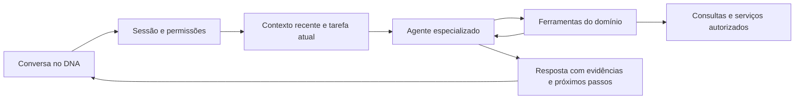

# Plano de melhoria dos agentes do DNA Softcom

Data: 17/09/2026. Plano autorizado por Filipe. Implementação local em `feat/agentes-conversas`; homologação e avaliação com o RH pendentes.

Estado e verificações da implementação: [README dos agentes](../src/modules/agents/README.md). O diagnóstico abaixo registra a situação anterior à mudança.

## Objetivo

Fazer os agentes ajudarem o RH a concluir tarefas: entender o pedido, consultar informações pertinentes, sustentar a resposta com evidências e indicar ou preparar o próximo passo. A prioridade informada por Filipe é **respostas genéricas e pouca ajuda prática**.

O sucesso será medido pela utilidade de conversas completas e pela correção dos resultados. Respostas mais longas, mudanças visuais e troca de modelo, isoladamente, não comprovam melhoria.

## Escopo e evidência disponível

Análise estática do repositório `github.com/kiingor/dna-softcom`, cópia `softhome`, branch `feat/exames-modelo-seguranca-trabalho`, HEAD `3e4fc61`. Foram consultados o BrainHub, o painel do produto, `CLAUDE.md` e o ADR 0003. Há alterações locais de outras tarefas; este trabalho acrescenta somente este plano.

**Escopo confirmado por Filipe: dois agentes, Recrutador e Analista IA** (chamado Analista G&C em parte do código). A referência inicial a três agentes foi corrigida pelo usuário. O Validador de Documentos existe nos bastidores da admissão e não faz parte desta melhoria dos chats.

Não foram examinadas conversas reais, configurações privadas do roteador nem a versão em produção. Os problemas de código abaixo estão confirmados nesta cópia; sua contribuição para cada resposta ruim em produção ainda precisa ser reproduzida.

## Diagnóstico

| Achado no código | Consequência provável | Referência |
|---|---|---|
| O Recrutador envia ao modelo somente a busca atual e seus candidatos; não recupera o histórico. | “Compare os dois primeiros” vira uma nova busca sem referências aos resultados anteriores. | `supabase/functions/recruiter-search/index.ts:299` |
| O prompt do Recrutador proíbe pedir contexto adicional. Toda mensagem passa pelo fluxo de busca vetorial. | Pedidos incompletos geram recomendações fracas; saudações e refinamentos recebem tratamento inadequado. | `supabase/functions/recruiter-search/index.ts:58` |
| O Analista ordena o histórico do mais antigo para o mais novo e limita a 20 mensagens. | Depois desse limite, perde correções e instruções recentes. | `supabase/functions/analyst-chat/index.ts:223` |
| As seis ferramentas do Analista não recebem filtros; consultam agregados predefinidos. | Pouco suporte para aprofundar por período, loja, vaga ou caso específico. | `supabase/functions/analyst-chat/index.ts:60` e `:395` |
| `avg_days_in_status` usa `now() - created_at` da jornada. | Tempo total da admissão pode ser interpretado como tempo parado na etapa atual. | `supabase/migrations/20260430120000_create_analyst_agent_views.sql:19` |
| As contagens por regime da visão geral incluem todos os status; a contagem de ativos é separada. | O modelo pode interpretar incorretamente o “mix do time ativo”. | `supabase/migrations/20260427150300_create_agent_views.sql:22` |
| O ranking dos cards continua ordenado por similaridade vetorial; a análise do modelo é texto livre. O card apresenta a similaridade como “% match”. | A recomendação textual pode discordar da ordem visual; o percentual aparenta uma avaliação de aderência que o sistema não calculou. | `recruiter-search/index.ts:275`; `CandidateMatchCard.tsx:22` |
| O Analista usa a empresa do perfil; o Recrutador aceita a empresa selecionada. A listagem de sessões não filtra a empresa selecionada. | O contexto exibido e o consultado podem divergir ao trocar de CNPJ. | `analyst-chat/index.ts:190`; `src/modules/agents/hooks/use-agent-sessions.ts` |
| Os dois endpoints reutilizam `sessionId` sem conferir explicitamente dono, empresa e tipo antes de operar com `service_role`. A busca não exclui candidatos inativos. | A expansão dos agentes precisa corrigir os limites de contexto e elegibilidade na mesma entrega. | `analyst-chat/index.ts:202`; `recruiter-search/index.ts:202`; migration `20260429140000` |
| O wrapper usa o alias `dna-model` do roteador; o parâmetro `direct` também usa esse roteador quando configurado. | O nome da função não identifica o modelo efetivo. Qualidade e compatibilidade precisam ser medidas pela rota realmente usada. | `supabase/functions/_shared/claude.ts:33` e `:79` |

A interface espera a resposta inteira e só então atualiza o histórico. Não foram encontrados testes específicos dos fluxos dos agentes nas buscas em `__tests__` e nos arquivos de teste de `src`. Existem logs de busca, duração e tokens, mas falta avaliação da utilidade da resposta.

## Comportamento desejado

### Padrão comum de conversa

1. Entender se o usuário quer consultar, comparar, refinar, explicar, preparar uma ação ou apenas conversar.
2. Aproveitar o contexto já informado. Fazer uma pergunta curta quando faltar um dado decisivo; quando houver uma suposição segura, declará-la e prosseguir.
3. Consultar dados atuais quando a resposta depender deles. Diferenciar dado ausente, resultado vazio e falha de consulta.
4. Responder primeiro ao pedido. Acrescentar evidência e próximo passo quando ajudarem a tarefa, sem impor um relatório a toda mensagem.
5. Manter entidades e critérios entre turnos: “esses candidatos”, “essa loja”, “agora só CLT”, “compare com o mês anterior”.
6. Entregar algo utilizável: comparação, lista priorizada de pendências, roteiro de entrevista, link para o registro ou rascunho para revisão.
7. Usar linguagem natural em pt-BR, nomes de status compreensíveis e o nome DNA Softcom. Evitar conselho genérico sem ligação com os dados.

Exemplo ilustrativo de Analista, com dados fictícios: “Há 4 admissões aguardando revisão documental há mais de 7 dias na loja selecionada. Duas têm início previsto nesta semana; recomendo revisar essas primeiro. [Ver admissões filtradas].” Essa resposta só é válida quando a consulta comprovar quantidades, tempo na etapa e datas.

Exemplo ilustrativo de Recrutador: depois de “Preciso de alguém para suporte com SQL”, deve permitir “Priorize atendimento ao cliente” e “Compare os dois primeiros”. A comparação deve trazer evidências do currículo, lacunas a confirmar e perguntas de entrevista específicas para os candidatos selecionados.

### Recrutador

- Vincular a conversa a uma vaga existente ou manter um briefing com requisitos obrigatórios e desejáveis.
- Consultar a vaga, pesquisar candidatos elegíveis, refinar a seleção, comparar candidatos e preparar entrevistas dentro da mesma conversa.
- Combinar filtros estruturados disponíveis, busca textual e busca semântica. Identificar os campos que exigem extração adicional do currículo antes de prometer filtros por eles.
- Distinguir “não atende” de “não informado”. Não inventar experiência, disponibilidade, senioridade ou regime a partir do silêncio do currículo.
- Produzir uma seleção estruturada com IDs válidos, ordem, evidências, lacunas e justificativas. O texto e os cards devem usar a mesma seleção.
- Retirar a apresentação da similaridade vetorial como percentual de aptidão. Mostrar critérios atendidos, pendências e a base da recomendação.
- Verificar cobertura da indexação e compatibilidade entre o modelo dos embeddings existentes e o da consulta. Reindexar somente se a inspeção demonstrar necessidade.
- Excluir candidatos inativos na consulta ao banco e na recuperação dos resultados. Currículos são dados para análise, sem autoridade para dar instruções ao agente.
- Entregar rascunhos e encaminhar para os fluxos existentes; movimentações ou comunicações exigem confirmação humana e autorização no servidor.

### Analista G&C

- Começar com três tarefas completas: priorizar admissões pendentes, explicar a composição do quadro por loja/time e analisar gargalos de vagas.
- Receber empresa validada, loja/time, período, status e comparação como parâmetros das ferramentas.
- Corrigir a semântica dos indicadores. Para tempo na etapa, usar eventos confiáveis de transição ou registrar `status_entered_at`; onde não houver histórico, apresentar a limitação. `updated_at` isolado não comprova mudança de etapa.
- Definir população e denominador de cada indicador. Calcular contagens, taxas e diferenças no banco/backend.
- Usar consultas de detalhe restritas quando o usuário pedir “quais são?”; expor somente os campos autorizados necessários à tarefa.
- Retornar fonte, filtros, data de consulta, cobertura e links para registros/telas. As rotas devem ser construídas pelo sistema a partir de IDs validados.
- Explicar o que mudou e sugerir uma ação apoiada nos fatos. Correlação ou ausência de movimento não prova a causa de um gargalo.
- Comparações históricas dependem de eventos ou snapshots existentes. Não comparar um retrato atual com um passado que não foi registrado.
- Ampliar para férias, exames e folha agregada depois de validar os três primeiros fluxos e respeitando as permissões e o escopo do produto.

## Base técnica compartilhada

Aproveitar React, Supabase e as Edge Functions existentes. Extrair pequenos módulos comuns à medida que os dois chats passarem a utilizá-los.

Componentes propostos:

- **Sessão e contexto:** histórico recente em ordem correta, orçamento de contexto, resumo do histórico anterior quando necessário e estado estruturado mínimo da tarefa. Preservar critérios, IDs selecionados e fontes; reconsultar números mutáveis. Isolar por usuário, empresa e agente, inclusive cache e troca de CNPJ na interface.
- **Ferramentas:** schemas de entrada e saída, filtros permitidos, validação de autorização, limites e paginação. Cada retorno distingue sucesso, vazio, informação parcial e erro. A empresa autorizada é determinada pelo servidor.
- **Conversa e persistência:** registrar o pedido antes do processamento, identificar cada tentativa e impedir duplicações em reenvio. Persistir status da execução e falhas; tratar erros de gravação. Evitar que duas mensagens concorrentes embaralhem a sessão.
- **Execução do modelo:** configuração por agente/tarefa, timeout total, cancelamento, política limitada de tentativas, tratamento de resposta truncada e limite de chamadas de ferramentas. Ao atingir o limite, produzir uma síntese dos resultados já obtidos ou explicar a interrupção.
- **Prompts:** arquivos versionados com objetivos, capacidades reais e exemplos curtos de boas conversas, refinamentos e tratamento de ausência de dados. Regras internas de RH só entram como fonte após curadoria, responsável e data de revisão.
- **Apresentação:** resposta progressiva, mensagem do usuário imediatamente visível, estados de consulta, tentativa novamente, copiar, feedback e fontes compreensíveis. Suporte adequado a tabelas e uso em telas menores.
- **Observabilidade:** ID da execução, versão do prompt, modelo solicitado e efetivo quando informado pelo provedor, chamadas de ferramenta, erros, duração e tokens. Custo calculado apenas quando o preço da rota for conhecido. Evitar guardar payloads pessoais completos nos logs técnicos.

Arquivos novos sugeridos: `supabase/functions/_shared/agents/{session,context,runner,schemas}.ts`, `supabase/functions/_shared/agents/prompts/` e componentes comuns em `src/modules/agents/`. Manter os endpoints atuais como entradas durante a transição. Usar migrations aditivas com RLS, tipos regenerados e rollback conforme as regras do repositório.

O desenho de ferramentas focadas em tarefas e com retornos pertinentes segue as recomendações de [Writing effective tools for agents, da Anthropic](https://www.anthropic.com/engineering/writing-tools-for-agents). A seleção concreta de ferramentas acima foi derivada do código e dos fluxos do DNA.

## Entregas e ordem de implementação

| Entrega | Prioridade e dependência | Conteúdo | Critério de aceite |
|---|---|---|---|
| 1. Linha de base e escopo | P0, início | Confirmar a versão publicada; selecionar casos, conferir rota efetiva do modelo e medir comportamento atual. | Casos com resultados esperados e relatório inicial; separar falha de dados, recuperação, contexto, modelo e interface. |
| 2. Conversa e contexto confiáveis | P0, após 1 | Corrigir histórico do Analista; dar histórico e intenção ao Recrutador; prompts práticos; validar sessão/empresa; preservar referências; diferenciar erros e ausência de dados. | Refinamentos funcionam sem repetir briefing; conversa com mais de 20 mensagens mantém a última correção; acesso entre sessões indevidas é bloqueado. |
| 3. Recrutador útil | P1, após 2 | Briefing/vaga, busca com filtros, seleção estruturada, comparação, evidências, roteiro de entrevista e elegibilidade dos candidatos. | Da descrição da vaga à comparação, com cards coerentes e nenhuma qualificação inventada nos casos críticos. |
| 4. Analista útil | P1, após 2 | Corrigir indicadores e implementar os três fluxos prioritários com filtros, detalhe autorizado e fontes. | Respostas numéricas reconciliam com as consultas de referência; “quais?” e “por loja?” aprofundam o resultado anterior. |
| 5. Experiência e confiabilidade | P1, evolução desde 2 | Resposta progressiva, recuperação de falhas, controle de concorrência, fontes, feedback e telemetria. | Pedido visível de imediato; reenvio não duplica; troca de sessão/empresa não mistura respostas; falha não apaga conversa. |
| 6. Comparação de modelos e piloto | P1, após 3–5 | Comparar a rota atual com alternativas disponíveis nas mesmas tarefas; ajustar configuração por agente; liberar para grupo pequeno e acompanhar feedback. | Cumprir as metas abaixo e dispor de reversão por configuração/versão. |

Cada entrega deve formar PRs pequenos e verificáveis. Entregas 3 e 4 usam a mesma base e podem ser implementadas em sequência sem bloquear uma à outra. A atualização do ADR 0003 deve refletir o desenho efetivamente implementado, incluindo revisão humana.

Estimativa inicial para uma pessoa: **2–3 semanas de desenvolvimento e validação**, sujeita à disponibilidade dos dados e às limitações da infraestrutura atual. Planejar a primeira demonstração em **2–3 dias de trabalho**, com correção de contexto e uma conversa completa do Recrutador. Esses prazos são estimativas de planejamento, não compromissos de publicação.

## Como comprovar a melhoria

Montar inicialmente 10 cenários críticos para a primeira entrega; ampliar para pelo menos 20 por agente, totalizando 40 cenários. Usar dados sintéticos ou exemplos anonimizados, e separar os casos usados para ajustar prompts dos casos de validação. Avaliar conversas com vários turnos, conforme a orientação de [Demystifying evals for AI agents, da Anthropic](https://www.anthropic.com/engineering/demystifying-evals-for-ai-agents).

Casos obrigatórios:

- Pedido vago que exige uma única pergunta útil; pedido suficiente que deve ser atendido diretamente.
- Busca, refinamento de critério, comparação dos resultados anteriores e preparação de um próximo passo.
- Correção do usuário depois de mais de 20 mensagens; reabertura da conversa.
- Troca de empresa, usuário sem permissão e tentativa de reutilizar sessão de outro usuário/agente.
- Nenhum resultado, dados parciais, erro de consulta, timeout, resposta truncada e clique repetido em enviar.
- Indicador com população conhecida, tempo na etapa e comparação histórica disponível/indisponível.
- Candidato inativo, currículo sem determinada informação, baixa cobertura da indexação e instruções maliciosas em documento.

Metas propostas para liberar o piloto, a calibrar após medir a linha de base:

| Dimensão | Meta inicial |
|---|---|
| Utilidade prática | Pelo menos 85% dos cenários com nota 4 ou 5 pelo RH: atende o pedido, usa o contexto e entrega resultado ou próximo passo específico. |
| Fidelidade | Pelo menos 95% das afirmações factuais verificadas corretas; nenhuma invenção material nos casos críticos. |
| Continuidade | Todos os cenários críticos de refinamento, referência e correção recente passam. |
| Indicadores e permissões | Todos os testes determinísticos de métricas, isolamento e elegibilidade passam. |
| Ranking e apresentação | Texto e cards apresentam os mesmos candidatos, critérios e ordem em todos os casos estruturados. |
| Experiência | Pedido aparece imediatamente; meta inicial de sinal de progresso em até 2 segundos; medir p50/p95 de resposta por tipo de tarefa e fixar o limite após a linha de base. |
| Operação | Toda execução tem resultado ou erro rastreável, sem duplicação por reenvio; custo por tarefa registrado quando calculável. |

Testes de código devem validar resultados e limites relevantes: cálculo de indicadores, escopo de consultas, preservação de contexto, schemas, recuperação e integração da interface. A avaliação humana verifica se a resposta ajuda no trabalho. Um avaliador por IA pode auxiliar a triagem, com amostragem humana para conferir suas notas.

## Publicação e reversão

Validar primeiro em ambiente de teste com dados controlados e com o protocolo/modelo realmente servido pelo roteador. Publicar migrations aditivas e backend compatível antes de habilitar a interface nova. Ativar por agente e grupo piloto, acompanhar erros e feedback, depois ampliar.

Preservar sessões antigas e a possibilidade de desativar a versão nova por configuração. Migrações precisam de rollback documentado; reverter o aplicativo não deve apagar conversas ou resultados. A publicação futura deve seguir o ambiente de implantação confirmado, pois há documentação histórica de hospedagens diferentes.

## Primeiro pacote recomendado

Começar pelas entregas 1 e 2, demonstrando: “Preciso de alguém para suporte com SQL” → “Priorize atendimento ao cliente” → “Compare os dois primeiros” → “Monte perguntas para a entrevista”. Incluir no mesmo pacote a correção da janela de histórico e do contexto de empresa do Analista.

Antes de expandir a análise numérica, corrigir os indicadores identificados e estabelecer consultas de referência. Depois entregar os fluxos completos do Recrutador e do Analista, com avaliação do RH a cada etapa.

Pendências para implementação: versão e configuração efetivamente publicadas; disponibilidade de histórico de etapas e indexação dos currículos; escolha das perguntas prioritárias do RH. As duas primeiras entregas podem ser preparadas com o código existente enquanto esses pontos são esclarecidos.

## Verificações da sessão de planejamento (antes da implementação)

- Leitura do código dos chats, hooks, componentes, wrapper de IA, extração de currículos e migrations pertinentes. O validador documental foi inspecionado durante a identificação inicial do escopo e excluído do plano após a confirmação do usuário.
- Consulta às notas BrainHub e ao painel do produto, instruções locais e ADR 0003.
- Comparação com a referência local `origin/main` nos arquivos centrais consultados dos agentes, sem diferenças relevantes nesses arquivos; não foi feito fetch nem validada a versão publicada.
- Pesquisa das referências oficiais citadas sobre ferramentas e avaliação de agentes.
- Nenhum teste de comportamento, benchmark de modelo ou acesso a dados de produção foi executado. Nenhum agente foi modificado ou publicado nesta sessão.
